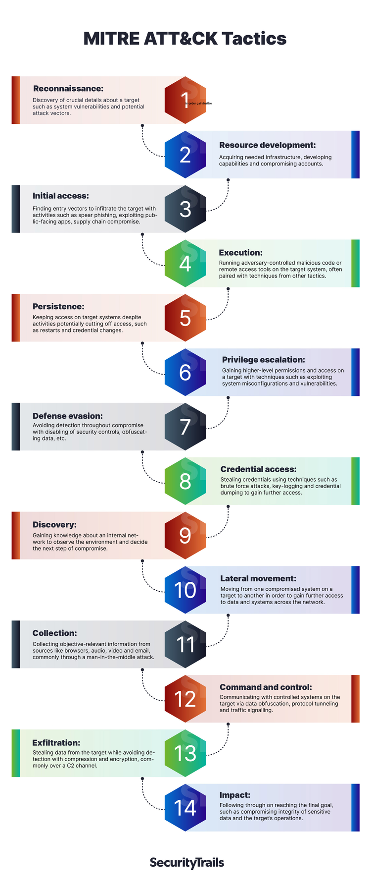
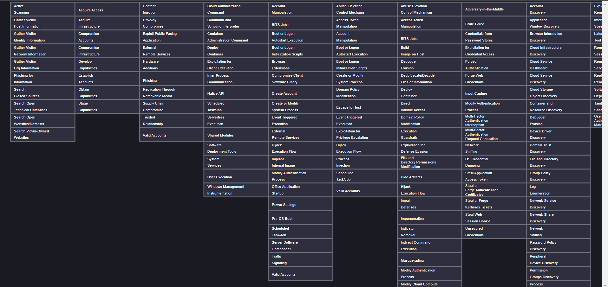
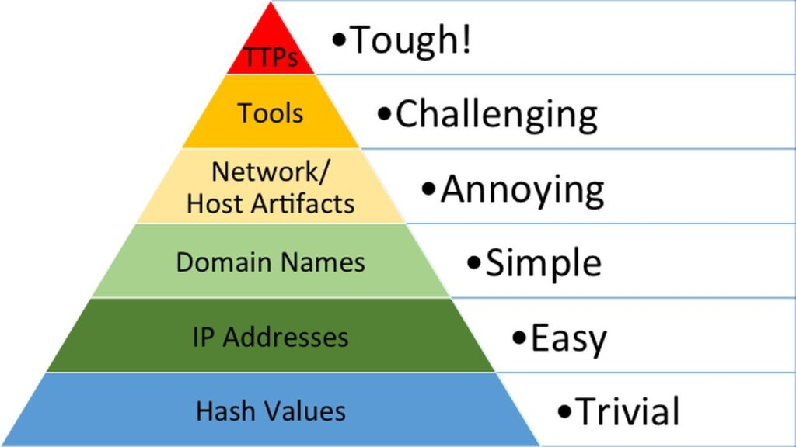

# Some key concepts in Cyber Security

### [MITRE ATT&CK :](https://attack.mitre.org/)

`MITRE` : massachusetts institute of technology research and engineering

`ATT&CK` : Adversarial Tactics, Techniques, and Common Knowledge
- its non-profit (open-source) organization, maintains and provides the framework as an open and publicly accessable resources.

- it was created by MITRE, in 2013.

- (TTPs) `Tactics`, `Techniques`, and `Procedures`.

- ATT&CK is open and available to any person or organization for use at no charge. 

- **MITRE ATT&CK®** is a globally-accessible knowledge base of adversary tactics and techniques based on real-world observations. The ATT&CK knowledge base is used as a foundation for the development of specific threat models and methodologies in the private sector, in government, and in the cybersecurity product and service community.

### What they Do?

- They provide a knowledge base of adversary tactics and techniques based on real-world observations.

- They collect and categorize known adversary behaviors and provide a common taxonomy for the security community to use when sharing information on threat actors and their actions.

- They provide a common language for the security community to use when discussing adversary behaviors.

- Manage structured framework for understanding the actions of an adversary.

### MITRE ATT&CK® Framework

- The MITRE ATT&CK framework is a knowledge base of adversary tactics and techniques based on real-world observations.

- The framework is used as a foundation for the development of specific threat models and methodologies in the private sector, in government, and in the cybersecurity product and service community.

- The Enterprise ATT&CK Matrix is a superset of the Windows, macOS and Linux matrices. The 2022 version of ATT&CK for Enterprise contains 14 Tactics, 193 Techniques, 401 Subtechniques, 135 Groups, 14 Campaigns and 718 Pieces of Software. 

- ### There are 14 tactics in the Enterprise ATT&CK Matrix:
    | Tactic                | Attacker(s) Objective                                       |
    |-----------------------|-------------------------------------------------------------|
    | 1. Reconnaissance      | Gather information they can use to plan future operations  |
    | 2. Resource Development| Establish resources they can use to support operations     |
    | 3. Initial Access      | Get into your network                                      |
    | 4. Execution           | Run malicious code                                         |
    | 5. Persistence         | Maintain their foothold                                    |
    | 6. Privilege Escalation| Gain higher-level permissions                              |
    | 7. Defense Evasion     | Avoid being detected                                       |
    | 8. Credential Access    | Steal account names and passwords                         |
    | 9. Discovery           | Figure out your environment                                |
    | 10. Lateral Movement    | Move through your environment                             |
    | 11. Collection         | Gather data of interest to their goal                      |
    | 12. Command and Control | Communicate with compromised systems to control them      |
    | 13. Exfiltration       | Steal data                                                 |
    | 14. Impact             | Manipulate, interrupt, or destroy your systems and data    |

    

- ### What Are Procedures?
    - Procedures are the specific implementations that adversaries use for techniques or subtechniques

- ### Benifits of MITRE ATT&CK® Framework
    - its ability to help organizations stay up-to-date with the latest threats and attack techniques.
    - The framework is regularly updated with new techniques and tactics as they emerge, ensuring that organizations are aware of the latest threats and can take proactive steps to mitigate them.
    - The framework also helps organizations improve their overall security posture and reduce risk.

- ### How Can I Use ATT&CK?

- The ATT&CK Matrix illustrates all known tactics and techniques in an easily comprehensible manner. In each column, individual techniques are listed at the top and attack tactics are displayed at the bottom. See the [Getting Started](https://attack.mitre.org/resources/) page for resources on how to start using ATT&CK.
- ATT&CK can be used in several ways to help security operations, threat intelligence and security architecture. 
**Some of the primary use cases are:**

    - Adversary Emulation
    - Red Teaming
    - Behavioral Analytics Development
    - Defensive Gap Assessment
    - SOC Maturity Assessment
    - Cyberthreat Intelligence

### [MITRE ATT&CK® Matrix](https://attack.mitre.org/matrices/enterprise/)

- The MITRE ATT&CK Matrix is a visualization of the tactics and techniques in the ATT&CK knowledge base.

- The matrix provides a visual representation of the relationship between tactics and techniques.

- 

- The matrix is organized into columns and rows. The columns represent tactics, and the rows represent techniques.

- **[MITRE ATT&CK Navigator](https://mitre-attack.github.io/attack-navigator/)** :  is a web-based tool for analyzing and understanding adversary behavior through the lens of the MITRE ATT&CK framework.

- **Threat Modeling** : is a structured approach to identifying and evaluating the potential threats to a system, and the possible ways those threats can be realized.

### What Is MITRE Engenuity?

- In collaboration with private companies, MITRE Engenuity is an organization that addresses public interest challenges in cybersecurity, infrastructure resilience, healthcare effectiveness and next-generation communications.

### Introduction to pyramid of pain - 
1. **hash value :** SHA1, MD5, easy to change
2. **IP address :** easy to change
3. **domain :** simple to change
4. **Network-based artifacts :** URI patterns, Network protocols 
5. **Host-based artifacts :** File names, Registry keys, File paths, Annoying to change
6. **Tools :** Malware, C2 (command and control), Exploits or password cracking tools, challenging to change
7. **TTPs :** Tactics, Techniques, and Procedures Tough to change

## CIA Triad : Confidentiality, Integrity, Availability

### Some Threads to Confidentiality

* **Phishing Attack :** this attacks aim to trick the victim divulging sensitive information, such as passwords, credit card numbers, or other personal information
    
    * **Vishing :** fishing through voice communication.
    - **Shishing :** fishing through SMS.
    - **Bating :** fishing through USB.

* **Spyware and keylogers :** These software programs design to collect and transmit personal or organaizational data from computer without the owner's knowladge or consent.

### Threads to Integrity

- **Data Breach :** Unauthorized access to sensitive data, often with malicious intent.

- **Malware Attack :** `Viruses`, `worms`, `trojans`, and other types of malware can corrupt or delete data.

- **Man-in-the-Middle Attack :** An attacker intercepts and alters communication between two parties without their knowledge.

### Threads to Availability

* **Denial of Service (DoS) Attack :** An attacker floods a system with traffic or requests, rendering it unavailable to legitimate users.
    - **Distributed Denial of Service (DDoS) Attack :** A DoS attack that uses multiple systems to launch the attack.

* **Ransomware :** Malware that encrypts a victim's files or device and demands a ransom for the decryption key.

## Risk Assessment

- An `Asset` is which we are trying to protect.

- A `Threat` is whome we are trying to protect it from.

- A `Vulnerability` is a weakness or gap in our protection efforts.

    **Note :** `Risk` is the intersection of `Asset`, `Threat`, and `Vulnerability`.

