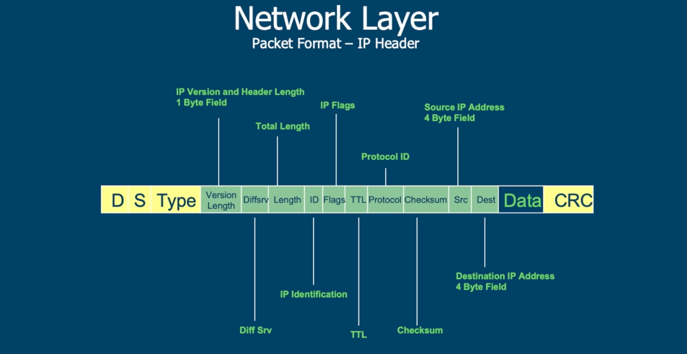
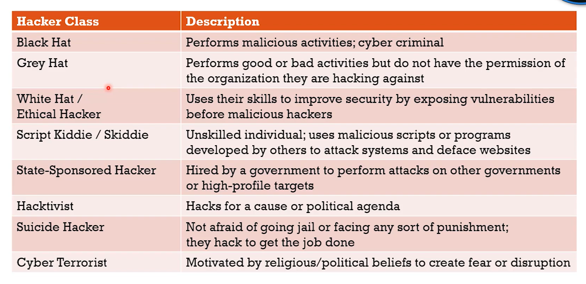

<h1 align = "center">Cyber Security concespts</h1>

### Table of Contents all at once

<!-- dont bold the text in content -->

- [Cyber Security concespts](#cyber-security-concespts)
  - [Table of Contents all at once](#table-of-contents-all-at-once)
  - [Cyber Security Basics](#cyber-security-basics)
    - [Cyber Security Careers](#cybersecurity-careers)
  - [cyber security keywords](#cyber-security-keywords)
    - [MX record:](#mx-record)
    - [AXFR:](#axfr)
    - [Reverse lookup:](#reverse-lookup)
    - [Brute force:](#brute-force)
    - [Subdomain:](#subdomain)
    - [Network Classes:](#network-classes)
  - [TCP:](#tcp)
    - [3 Way Handshake:](#3-way-handshake)
    - [TCP Header](#tcp-header)
  - [IP (internet Protocol)](#ip-internet-protocol)
    - [IP header :](#ip-header)
  - [Reverse engineering:](#reverse-engineering)
  - [Bash:](#bash)
  - [Vulnerability:](#vulnerability)
  - [Bind Shell vs Reverse shell:](#bind-shell-vs-reverse-shell)
  - [Traffic Smuggling](#traffic-smuggling)
  - [Native Windows API](#native-windows-api)
  - [White-listed Domain Abuse](#white-listed-domain-abuse)
  - [CAP Theorem:](#cap-theorem)
  - [ASIC:](#asic)
  - [ICMP:](#icmp)
  - [Footprinting:](#footprinting)
  - [Fuzzing :](#fuzzing)
  - [Enumeration:](#enumeration)
  - [Cyber Security threats](#cyber-security-threats)
- [Threat Intelligence](#threat-intelligence)
  - [Cryptographic Attacks](#cryptographic-attacks)
    - [Birthday Attack :](#birthday-attack)
    - [Rainbow Table Attack :](#rainbow-table-attack)
    - [Online vs Offline Attacks :](#online-vs-offline-attacks)
    - [Downgrade Attack :](#downgrade-attack)

#### **Cybersecurity Careers**

### cyber security keywords

#### **MX record:**

- A DNS 'mail exchange' (MX) record directs email to a mail server. The MX record indicates how email messages should be routed in accordance with the Simple Mail Transfer Protocol (SMTP, the standard protocol for all email).

#### **AXFR:**

- AXFR (global Asynchronous Transfer Full Range) is a protocol for “zone transfers” for replication of DNS data across multiple DNS servers. Unlike normal DNS queries that require the user to know some DNS information ahead of time, AXFR queries reveal resource records, including subdomain names.

#### **Reverse lookup:**

- In computer networks, a reverse DNS lookup or reverse DNS resolution (rDNS) is the querying technique of the Domain Name System (DNS) to determine the domain name associated with an IP address – the reverse of the usual "forward" DNS lookup of an IP address from a domain name.

#### Brute force:

- A brute-force attack is a trial-and-error method used by application programs to decode login information and encryption keys to use them to gain unauthorized access to systems.

#### **Subdomain:**

- A subdomain is a separate part of your website that operates under the same primary domain name.

#### **Network Classes:**

- Class A: 10.0.0.0 to 10.255.255.255
- Class B: 172.16.0.0 to 172.31.255.255
- Class C: 192.168.0.0 to 192.168.255.255

### **TCP:**

- Transmission Control Protocol (TCP) is a standard that defines how to establish and maintain a network conversation by which applications can exchange data.

#### **3 Way Handshake:**

1. First PC sends a random sequence number and sets SYN flag = 1 (syn = 1 for connection request).
2. Second PC replies for the sequence with Acknowledgement no (sequence no + 1) and sends ACK no = 1 (1 for confirmation) in reply to the SYN flag and also requests a connection back with SYN flag = 1 to the first PC.
3. When ACK & SYN and a sequence no are received by the first PC, it replies back in response to SYN with ACK no (sequence + 1) and ACK flag = 1.
   So this is how the 3 Way Handshake Happens In TCP.

#### **TCP Header**

- **Sequence Number** – A 32-bit field that holds the sequence number, i.e., the byte number of the first byte that is sent in that particular segment. It is used to reassemble the message at the receiving end of the segments that are received out of order.
- **Acknowledgement Number** – A 32-bit field that holds the acknowledgment number, i.e., the byte number that the receiver expects to receive next. It is an acknowledgment for the previous bytes being received successfully.
- **Control flags –** These are 6 1-bit control bits that control connection establishment, connection termination, connection abortion, flow control, mode of transfer, etc. Their function is:
  - URG: Urgent pointer is valid
  - ACK: Acknowledgment number is valid( used in case of cumulative acknowledgment)
  - PSH: Request for push
  - RST: Reset the connection
  - SYN: Synchronize sequence numbers
  - FIN: Terminate the connection

### IP (internet Protocol)

Internet Protocol (IP) is the principal communications protocol in the Internet protocol suite for relaying datagrams across network boundaries. Its routing function enables internetworking and essentially establishes the Internet.

#### **IP header :**

- **D** - Destination IP address
- **S** - Source IP address
- **Type** - What comming next (TCP, UDP, ICMP)
- **Diffserv** - Differentiated Services (DiffServ) is a network solution that uses six-bit fields in the IP header to classify IP traffic flow into traffic classes
- **Length** - it has 16 bits and it is used to specify the total length of the IP packet in bytes.
- **ID** - Identification number of the packet, it has 16 bits.
- **Flags** - Fragmentation flags, it has 3 bits.
- **TTL** - Time to live which means how many hops the packet can take before it dies (hopes are routers), it has 8 bits.
- **Checksum** - Checksum of the header means the header is not corrupted, it has 16 bits.
- **Src** - Source IP Address (32 bits).
- **Dst** - Destination IP Address (32 bits).
- **Data** - Data of the packet. (Variable length)
- **CRC** - Cyclic Redundancy Check (CRC) is an error-detecting code commonly used in digital networks and storage devices to detect accidental changes to raw data.

###

#### **Reverse engineering:**

- The process of taking a piece of software or hardware and analyzing its functions and information flow so that its functionality and behavior can be understood.

#### **Bash:**

- Bourne-again shell, is a command-line shell and scripting language used on Linux, macOS, and other Unix-like operating systems

#### **Vulnerability:**

- A vulnerability is a weakness that can be exploited by cybercriminals to gain unauthorized access to a computer system.

#### **Bind Shell vs Reverse shell:**

- **Bind Shell:**
  - When a vulnerable machine listens for a connection.
- **Reverse Shell:**
  - When a vulnerable machine tries to connect.

#### **Traffic Smuggling**

#### **Native Windows API**

#### **White-listed Domain Abuse**

#### **CAP Theorem:**

- Consistency, Availability, Partition tolerance
- It is impossible to distribute a system to simultaneously provide more than two of the three of the guarantees.

#### **ASIC:**

- Application Service Integrated Circuit, used for bitcoin mining.

#### **ICMP:**

- Internet Control Message Protocol (ICMP) is a network layer protocol that is used to diagnose communication errors. `ICMP` is used for diagnostics and network management. For example, the `ping` utility uses an `ICMP` request and `ICMP` reply message.

#### **Footprinting:**

- The process of cybersecurity footprinting involves profiling an organization and collecting data about the network, host, employee, and third-party partners, like which OS is used, which services used and its versions, firewall protocols, IPs, DNS.

#### **Fuzzing :**

- Fuzzing is a technique used to find vulnerabilities in software, operating systems, and networks. It's also known as fuzz testing.
  - **The steps for fuzz testing are**:
    - Identify the target system
    - Identify inputs
    - Generate fuzzed data
    - Execute the test using fuzzy data

#### **Enumeration:**

- It's nothing but gathering information about the

### **Cyber Security threats**

- **Malware :** It's an malicious software intended to harm or exploit any programmable devices, service or network.

- **Ransomware :** Ransomware is a type of malware that encrypts a victim's files or device and demands a ransom for the decryption key

- **Social Engineering** - Social engineering is the manipulation of individuals to extract sensitive information. For example, phishing, Emails.

- **Denial of Service (DoS):** It's a cyber attack aimed at disrupting the normal functioning of a computer system, network, or service by overwhelming it with a flood of illegitimate requests or traffic, making it temporarily or indefinitely unavailable to users. The goal is to exhaust the target's resources, such as bandwidth, processing power, or memory, causing a disruption in services.

- **DDoS:** (Distributed Denial of Service) attacks involve multiple systems coordinating the attack, making them more potent and challenging to mitigate.

#### **Payloads :**

- Payload in the context of malware refers to malicious code that causes harm to the targeted victim. Malware payloads can be distributed by methods such as worms and phishing emails.
- Payloads can be delivered to your computer through: Email attachments, Malicious websites, USB drives.
- Today, malware authors typically encrypt the payload to hide the malicious code from antimalware detection and remediation tools

#### **Trojan :**

- A Trojan is a type of malware disguised as legitimate software that trick users into loading and executing it on their systems. Once activated, Trojans can enable cyber-criminals to spy on you, steal your sensitive data, and gain backdoor access to your system.

#### **Ransomware :**

- Ransomware is a type of malware that encrypts a victim's files or device and demands a ransom for the decryption key.

#### **IOC :**

- Indicators of Compromise (IOCs) are pieces of forensic data, such as data found in system log entries or files, that identify potentially malicious activity on a system or network.

#### **Reconnaissance :**

- Reconnaissance is the information-gathering stage of ethical hacking, where you collect data about the target system.

#### **Hack Value :**

- Perceived value or worth of a targate as seen by the attacker

#### **Zero-Day Attack / O day attack :**

- An attack that occurs before a vendor is aware of flaw or is able to provide a patch for the flaw.

#### **Daisy Chaining / Pivoting :**

- Using a sucsessfull attack immediately launch another attack.

#### **Doxing :**

- publishing personally idenfiable information (PII) about an individual usually with malicious intent.

#### **Non-repudiation :**

- The inability to deny that you did something, usually accomplished through requirement authentication andd digital signature on documents.

#### **Mitigation :**

- Any action or control used to minimize Damage in the event of negative event.

#### **inetial Access :**

- The first step in the cyber kill chain/mitre att&ck, where the attacker gains access to the target system.

#### **Parsistence:**:

- The ability of malware to survive a reboot.

#### **Spear Phishing :**

- A phishing attack that is targeted at a specific individual or group.

#### **Control :**

- Planting a backdoor or other malware on a system to maintain access.

### Hacker Classes

### **Testing Types**

#### **White Box :**

- internal team will perform it, have complete visiblity
- risk: Teams already familiar with a system will overlook the vulnerabilities

#### **Grey Box :**

- The tester has some visibility into the system they are testing

#### **Black Box :**

- No visibility to the tester
- Most closely resemble actual attack

### **SIEM** (Security Information and Event Management)

- **SIEM** stands for Security Information and Event Management. It is a comprehensive approach to cybersecurity that involves the integration of security information management (SIM) and security event management (SEM) functions into a single security management system.

- **Some key features of SIEM include:**
  - **Log Management:** SIEM systems collect, aggregate, and store log data from a wide range of sources, including security devices, servers, and applications.
  - **Real-Time Monitoring:** SIEM systems provide real-time monitoring of security events, allowing security teams to detect and respond to threats as they occur.
  - **Threat Detection:** SIEM systems use advanced analytics and machine learning to detect and respond to security threats.
  - **Incident Response:** SIEM systems provide incident response capabilities, allowing security teams to investigate and respond to security incidents.

#### **UEBA** **U**ser and **E**ntity **B**ehavior **A**nalytics

- UEBA is a cybersecurity technology that focuses on analyzing and understanding the behavior of users and entities (such as devices, applications, and servers) within an organization's network. The goal of UEBA is to detect and respond to abnormal or anomalous behavior that may indicate potential security threats.

### SOAR

- **SOAR** Securonix provides SOAR solutions that enable organizations to automate and orchestrate their response to security incidents. This can enhance the efficiency and effectiveness of incident response workflows.

### Endpoint privilege management

- **Endpoint privilege management (EPM)**
  - EPM ensures that end-users have the least privilege when running trusted applications.
  - By using EPM, organizations can:
    - Prevent and contain attacks on desktops, laptops, and servers.
    - Reduce the risk of information theft or ransomware encryption.

### Some techniques of exploiting public facing applications

#### **Buffer Overflow :**

- A buffer overflow occurs when a program writes more data to a buffer than it can hold. This can cause the program to crash or allow an attacker to execute arbitrary code.

#### **Cross-Site Scripting (XSS) :**

- Cross-site scripting (XSS) is a type of security vulnerability that allows attackers to inject malicious scripts into web pages viewed by other users. This can be used to steal information or perform other malicious actions.

#### **SQL Injection :**

- SQL injection is a type of security vulnerability that allows attackers to execute arbitrary SQL commands on a database. This can be used to steal information or perform other malicious actions.

#### **Command Injection :**

- Command injection is a type of security vulnerability that allows attackers to execute arbitrary commands on a system. This can be used to steal information or perform other malicious actions.

#### **Man-in-the-browser :**

- A proxy Trogen horse that infects web browsers and capture browser sessions data.

## Threat Intelligence

### Cryptographic Attacks

#### **Birthday Attack :**

- In a classroom of 23 students, there is a 50% chance that two students will have the same birthday.
  - For a class of 30 students, the probability increases to 70%.
- In digital world this is a hash collision.
  - Hash collision is when two different inputs produce the same output in a hash function.
  - Find through [bruet force]("/README.md/##Threat-Intelligence") attack.
- The Attacker will muliple inputs and hash them to find a collision.
  - Protect yourself with a larger hash size.
- MD5 hash

  - Message Digest Algorithm 5
  - First published in 1992
  - Collisions found in 1996

- **How to protect yourself from hash collision attacks?**
  To protect yourself from hash collision attacks, you should use a hash function that has a large output size. This makes it more difficult for an attacker to find a collision. You should also use a hash function that is resistant to collision attacks, such as SHA-256 or SHA-3.

#### **Rainbow Table Attack :**

- A rainbow table is a precomputed table for reversing cryptographic hash functions, usually for cracking password hashes.
- | Hash                             | Password |
  | -------------------------------- | -------- |
  | 5f4dcc3b5aa765d61d8327deb882cf99 | password |
  | 098f6bcd4621d373cade4e832627b4f6 | test     |
  | 25d55ad283aa400af464c76d713c07ad | 123456   |

  this is how a rainbow table looks like.

- **How to protect yourself from rainbow table attacks?**
  To protect yourself from rainbow table attacks, you should use a strong password hashing algorithm that includes a salt. A salt is a random value that is added to the password before it is hashed. This makes it more difficult for an attacker to use a rainbow table to crack the password.

#### **Online vs Offline Attacks :**

- **Online Attack :** Is against a live logon prompt.(live logon prompt: when you are trying to log in to a system)
- **Offline Attack :** The attacker working on their own independent computers to compromise a password hash.

- **How collision can make a hash function vulnerable?**
  if hash collision occurers, it means that two different inputs produce the same output in a hash function. This can be used by an attacker to create a malicious file that has the same hash as a legitimate file. This is known as a collision attack.

#### **Downgrade Attack :**

- A downgrade attack is a type of attack where an attacker forces a system to use an older, less secure version of a protocol or encryption algorithm. This can make it easier for the attacker to exploit vulnerabilities in the older version of the protocol or algorithm.

- **SSL Stripping :**

  - Combines an on-path attack with a downgrade attack.
  - Difficult to impliment but big returns for the attacker.
  - Attacker must sit between middle of the conversation.
  - Victim's browser page isn't encrypted.
  - Strip the `S` from `HTTPS` and the attacker can see the data.

- **How to protect yourself from downgrade attacks?**
  To protect yourself from downgrade attacks, you should always use the latest, most secure versions of protocols and encryption algorithms. You should also ensure that your systems are configured to reject connections that use older, less secure versions of protocols.

### impact of vulnerabilities

#### 1. Race condition:

- The behavior of software, electronic, oranother system's output is dependent on the timing, sequence of events, or a factor out of the user's control.

### Security checks

#### **Firewall**
- A network security system that monitors and controls incoming and outgoing network taraffic based on predetermined security rules.

  1. **ACL** (Access control lists): to contro incoming/outgoing traffic
     - Application-based: Protect the user from applications and serivices by monitoring and potentially blocking the input, output.
     - Network-based: filtering traffic based on firewall rules and allows only authorized traffic to pass in and out of the network.

- **Statefull vs Stateless**
  - Statefull: Stateful firewalls block traffic based on the state of th epacket within a session. It adds and maintains info about a user's connections in a state table,(connection table)
  - Stateless: use ACL to identify allowed add/or blok traffic through filtering

### Network Configurations

#### VPN connector:

A type of router device that allowes for the secure creation of VPN connections and for the safe delivery of messages between VPN nodes. Allows for the handling of a large quantity of VPN tunnels.

<!-- 

[click](#remote-acess) -->

- **Remote Acess :** A user-to-LAN connection used by romote users.

- **Site-to-Site :** Allows multiple sites to connect to remote sites over the internet.

#### IPSec: 
A protocol suite for securing Internet Protocol(IP) communications. Encrypts and authenticates all of the packets in a session etween hosts or networks. Secures more applications then SSL and TLS.

- **Tunnel mode :** The default mode for IPSec, the entire pack is protected.

- **Transport mode :** use to end-to-end communications in IPSec. Ex. encrypted Telnet or Remote Desktop session from a workstation to a server.
