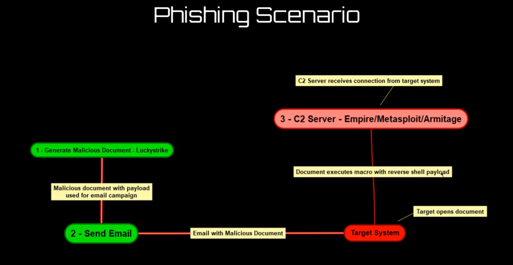
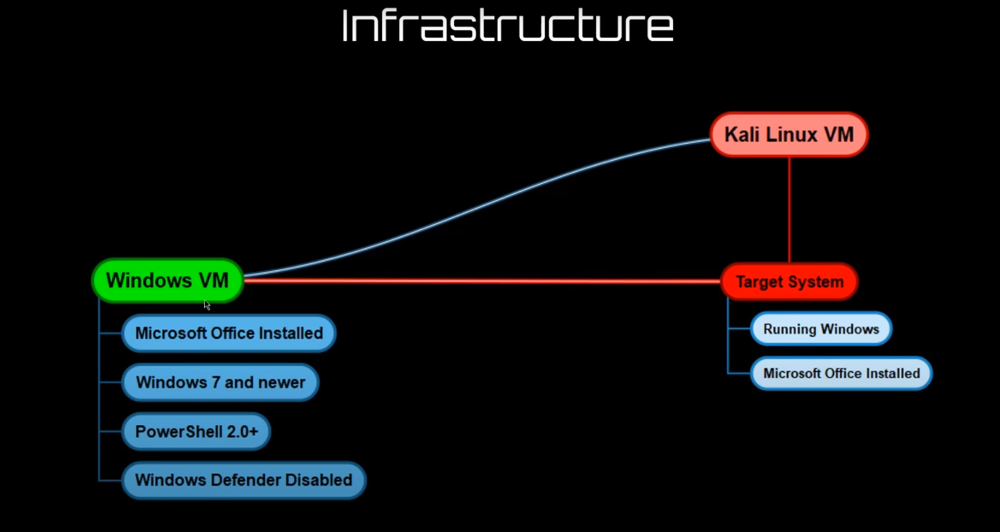
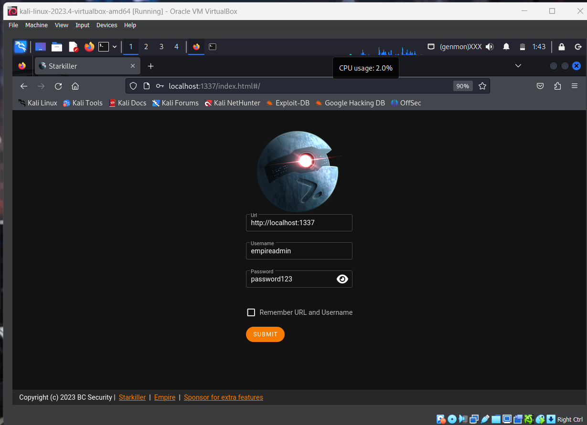

# Exploitation Technique

## Contents
- [Introduction](#introduction)
- [Setting up the infrastructure](#setting-up-the-infrastructure)
- [Initial Access](#initial-access)
    - [Exploiting public facing applications](#exploiting-public-facing-applications)
    - [Phishing](#phishing)
        - [Go Phishing](#go-phishing) 
    - [Removable Media](#removable-media)
    - [Supply Chain Compromise](#supply-chain-compromise)
    - [Spear Phishing](#spear-phishing)
    - [Whaling](#whaling)
    - [Vishing](#vishing)
    - [Smishing](#smishing)
    - [Watering Hole](#watering-hole)
    - [Drive-by Compromise](#drive-by-compromise)
    - [Malicious Documents](#malicious-documents)
    - [Malicious Software](#malicious-software)
    - [Malicious Scripts](#malicious-scripts)
    - [Exploitation Frameworks](#exploitation-frameworks)
- [conclusion](#conclusion)
  

## Introduction
Exploitation is the process of taking advantage of a vulnerability in a system or application to gain unauthorized access or perform unauthorized actions. The exploitation phase is the third phase of the cyber attack process, following reconnaissance and enumeration. The exploitation techniques are used to exploit the vulnerabilities identified during the reconnaissance and enumeration phases. This document will discuss various exploitation techniques used by Red Teamers.

## Setting up the infrastructure
<!-- 
 -->

### Setting up Empire
- Empire is a post-exploitation framework that includes a collection of modules for performing various post-exploitation tasks, such as privilege escalation, lateral movement, and data exfiltration.
- Empire is designed to be used in a red teaming environment to simulate real-world attacks. 
- Empire is written in Python and PowerShell and is cross-platform, running on Windows, Linux, and macOS, it is designed to be used in a red teaming environment to simulate real-world attacks. 
[for more](https://github.com/EmpireProject/Empire) 


- it is listed in repo of kali so you can install it using `apt install empire` or you can use the following commands to install it.

```bash
sudo apt install -y powershell-empire starkiller

# for server
sudo powershell-empire server
```

```bash
# and then run the following command in another terminal
sudo powershell-empire client
```


    jsut got to the plubins and start the csharpserver.


## Initial Access
The initial access phase is the first phase of the exploitation process. It involves gaining access to the target system or network. The initial access can be gained using various techniques, including phishing, spear phishing, whaling, vishing, smishing, watering hole, drive-by compromise, malicious documents, malicious software, malicious scripts, and exploitation frameworks.

### Exploiting public facing applications
In single line we can say that, Exploiting public facing applications is process of exploiting the vulnerabilities in the public facing applications to gain unauthorized access to the target system or network. The public facing applications include web applications, mobile applications, and other internet-facing applications. The vulnerabilities in the public facing applications can be exploited using various techniques, including:

- [Buffer Overflow](/README.md/#buffer-overflow)
- [Cross-Site Scripting (XSS)](/README.md/#cross-site-scripting-xss)
- [SQL Injection](/README.md/#sql-injection)
- [Command Injection](/README.md/#command-injection)
- File Inclusion
- File Upload
- Local File Inclusion (LFI)
- Remote File Inclusion (RFI)
- Path Traversal
- Server-Side Request Forgery (SSRF)
- XML External Entity (XXE)
- Insecure Deserialization
- Server-Side Template Injection (SSTI)
- Server-Side Includes (SSI)
- LDAP Injection
- XML Injection
- XPath Injection
- Cross-Site Request Forgery (CSRF) 
- Open Redirect
- Clickjacking
- Server-Side Scripting
- Client-Side Scripting
 


### Phishing
Phishing is the process of sending fraudulent emails to trick recipients into revealing confidential information, such as passwords and credit card numbers. The phishing emails often contain links to fake websites that look like legitimate websites, such as online banking websites and social media websites.


#### Go Phishing

Go Phishing is a phishing tool that allows you to create and send phishing emails to your targets. It is designed to help you test the security awareness of your organization's employees.


### Removable Media

Removable media is a type of storage media that can be removed from a computer without shutting down the computer. Examples of removable media include USB flash drives, external hard drives, and memory cards. Removable media can be used to transfer malware from one computer to another.