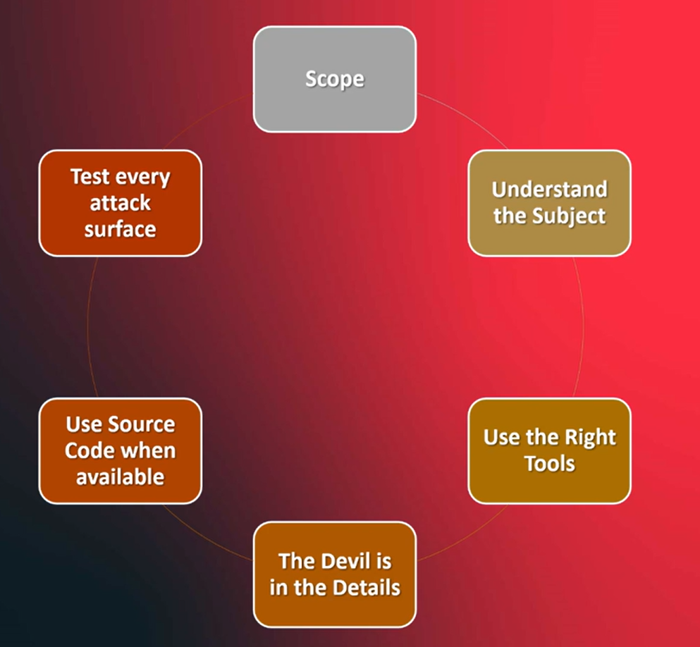

# Red Team Introduction

### What is red team?

Red team is a group of people who are responsible for testing the security of an organization. They are responsible for finding vulnerabilities and weaknesses in the organization's security posture. They do this by simulating real-world attacks on the organization's systems and networks. The goal of red team is to identify and fix any security issues before they can be exploited by real attackers.

### why do we need red team?

 - APT Groups: Advanced Persistent Threats (APTs) are groups of attackers who are highly skilled and well-funded. They are often sponsored by nation-states and have the resources to carry out sophisticated attacks.

 - Hacktivists: Hacktivists are individuals or groups who carry out cyber attacks for political or social reasons. They often target organizations that they believe are acting against their interests. 

 - Script Kiddies: Unskilled kids use pre-made tools made by proffesionals to attack systems for fun or to show off.

 - Nation State: Nation states are countries that carry out cyber attacks for political or military reasons. They often target other countries' government and military systems.

 - Organized Crime: Organized crime groups carry out cyber attacks for financial gain. They often target banks, financial institutions, and other organizations that handle large amounts of money.

 - Cyberterrorists: Cyberterrorists are individuals or groups who carry out cyber attacks for the purpose of causing fear and panic. They often target critical infrastructure such as power plants, water treatment facilities, and transportation systems.

### Why organizations should use Red Teaming?

- End users get blamed for cyberattacks
- Coporate Governance drives security
- Lack of security Policies is not unique to any one orgaization
- Companies: Small, medium, large

### what is penetration testing?

-Penetration testing is security testing in which assessors mimic real-world attacks to identify methods fo rcircumveneitng the security features of an application, system, or network.
- it often involves launchig real attacks on real systems and data that use tools and techniques commonly used by attackers. Most pentest involve looking for combinations of vulnerabilities on one or more systes that can be used to gian more access than could be achieved through a single vulnerability 
- **However, penetration testing is different from Red teaming.**
    - main difference is that penetration testing is a more formal and structured process, while red teaming is more of a creative and open-ended process.

### What is a Red Team Exercise

- Application Penetration Test
- Network Penetration Test
- Physical Penetratio Test
- Wireless Penetratin Test
- Social Engineering
- Client Side Penetration Test
- Server Side Penetration Test

- **Technical Skills**
    - Application Penetration Test
    - Network Penetration Test
    - Physical Security Expert
    - Cloud Penetration Testr
    - Many more

## [Adversary Emulation with Caldera](/RCDU%20CyberSec/Adversary_Emulation_with_Caldera.md)