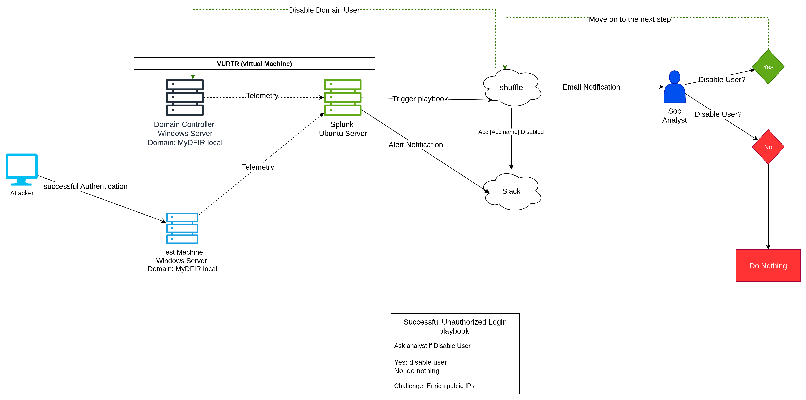

# Day 1

Description: Here we will create a diagram of the lab environment using draw.io or any other diagramming tool. this will help visualize the components and their interactions within the Active Directory lab setup.

- Create a diagram of the lab environment using draw.io or any other diagramming tool.

Flow:
- Attacker Machine (Kali Linux) lgoin to the Domain Controllers (Windows Server) and Test Machine.
- Test Machine will then send logs to the Splunk Server.
- Splunk Server in Ubuntu will trigger playbooks and sent to suffle, and sent notification to Slack.
- suffle will then send email to SOC analyst, if soc says yes then it will send to suffle instruct Domain Controllers (Windows Server) to desable the user account.
- suffle will then sent notification to Slack about the user account being disabled.

## You can view the diagram
.