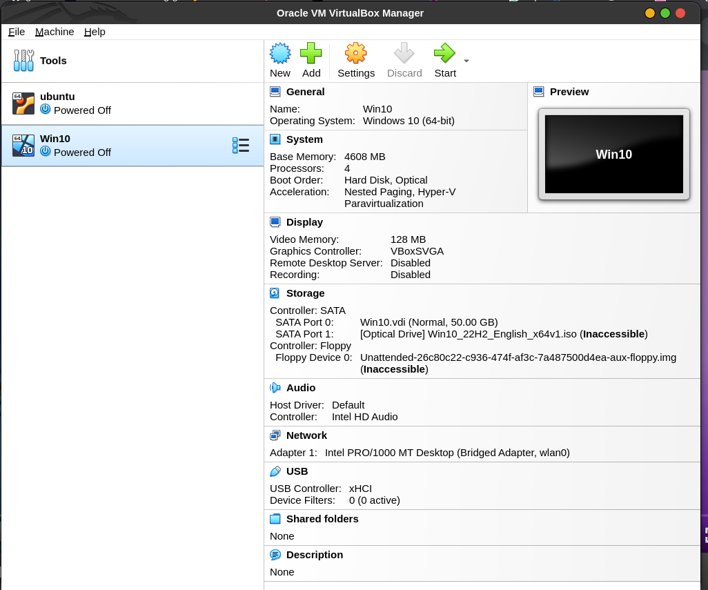
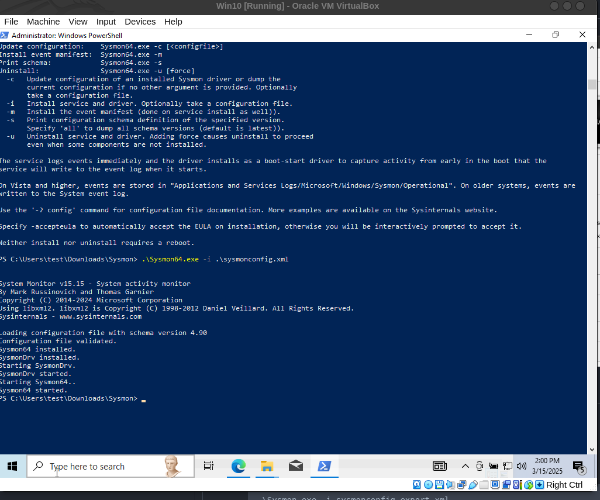
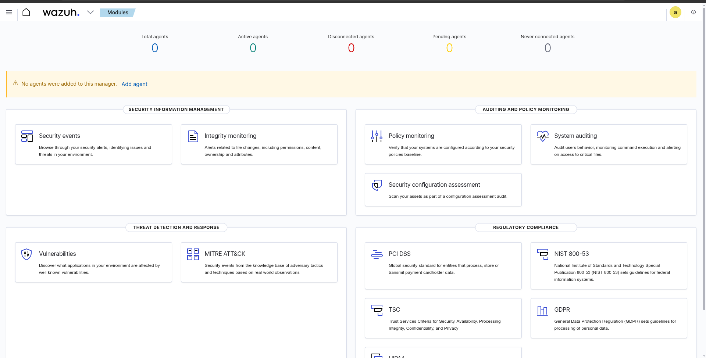

# Installing & configuring machines

## Installing windows 10 on Virtual Box

1. Download Virtual Box from [here](https://www.virtualbox.org/wiki/Downloads)
2. Download Windows 10 ISO from [here](https://www.microsoft.com/en-us/software-download/windows10)
3. Install Virtual Box
4. Create a new Virtual Machine
5. Follow the steps to install Windows 10

It will Look like this:


## Download sysmon on windows 10 VM
1. Download sysmon from [here](https://docs.microsoft.com/en-us/sysinternals/downloads/sysmon)
2. Download the configuration file from [here](https://raw.githubusercontent.com/olafhartong/sysmon-modular/refs/heads/master/sysmonconfig.xml)
3. Extract the sysmon zip file and move the sysmonconfig.xml file to the same directory
4. Open a PowerShell window as an administrator
5. Run the following command to install sysmon with the configuration file:
```bash
.\Sysmon.exe -i sysmonconfig-export.xml
```
 

## Installing Wazuh Server on Ubuntu 22.04

Note: We will be using Cloud (digital ocean) to install Wazuh server. You can use any cloud provider or your local machine to install Wazuh server.

I am using my $200 credit from GitHub Education Pack to create a droplet on Digital Ocean.

creating Droplet for wazuh server
pass: `f1nd1fY0uc4n`
IP: `<wazuh-server-ip>`

we ssh into that machine using 

```
ssh root@<wazuh-machine-ip>
```

then we update and upgrade the machine using 

```
apt update && apt upgrade -y
```
### Install Wazuh 4.7
```bash
curl -sO https://packages.wazuh.com/4.7/wazuh-install.sh && sudo bash ./wazuh-install.sh -a
Extract Wazuh Credentials
sudo tar -xvf wazuh-install-files.tar
```

Once the installation is done, you can access the Wazuh server using the IP 
with the following credentials:

User: `admin`
Password: `JNTQkc9h0hLfwNknJ*t2JYtEdni4Yh.V`

After logging in, you will see the following dashboard:


## Installing theHive on Ubuntu 22.04

`Note`: We will be using another droplet on Digital Ocean to install TheHive. You can use any cloud provider or your local machine to install TheHive.
for the time being, we will use the same credentials as the Wazuh server, which is 
pass: `f1nd1fY0uc4n`
theHive IP: `<theHive-IP>`

`Note`: For installing the hive we need to first install four components which are `Elasticsearch`, `Java`, `Cassandra`, and `TheHive`.

### Installing Java

```bash
wget -qO- https://apt.corretto.aws/corretto.key | sudo gpg --dearmor  -o /usr/share/keyrings/corretto.gpg
echo "deb [signed-by=/usr/share/keyrings/corretto.gpg] https://apt.corretto.aws stable main" |  sudo tee -a /etc/apt/sources.list.d/corretto.sources.list
sudo apt update
sudo apt install java-common java-11-amazon-corretto-jdk
echo JAVA_HOME="/usr/lib/jvm/java-11-amazon-corretto" | sudo tee -a /etc/environment 
export JAVA_HOME="/usr/lib/jvm/java-11-amazon-corretto"
```

### Installing Cassandra

```bash
wget -qO -  https://downloads.apache.org/cassandra/KEYS | sudo gpg --dearmor  -o /usr/share/keyrings/cassandra-archive.gpg
echo "deb [signed-by=/usr/share/keyrings/cassandra-archive.gpg] https://debian.cassandra.apache.org 40x main" |  sudo tee -a /etc/apt/sources.list.d/cassandra.sources.list
sudo apt update
sudo apt install cassandra
```

### Installing Elasticsearch

```bash
wget -qO - https://artifacts.elastic.co/GPG-KEY-elasticsearch |  sudo gpg --dearmor -o /usr/share/keyrings/elasticsearch-keyring.gpg
sudo apt-get install apt-transport-https
echo "deb [signed-by=/usr/share/keyrings/elasticsearch-keyring.gpg] https://artifacts.elastic.co/packages/7.x/apt stable main" |  sudo tee /etc/apt/sources.list.d/elastic-7.x.list
sudo apt update
sudo apt install elasticsearch
```

### Installing TheHive

```bash
wget -O- https://archives.strangebee.com/keys/strangebee.gpg | sudo gpg --dearmor -o /usr/share/keyrings/strangebee-archive-keyring.gpg
echo 'deb [signed-by=/usr/share/keyrings/strangebee-archive-keyring.gpg] https://deb.strangebee.com thehive-5.2 main' | sudo tee -a /etc/apt/sources.list.d/strangebee.list
sudo apt-get update
sudo apt-get install -y thehive
```

Default Credentials on port 9000
credentials are 'admin@thehive.local' with a password of 'secret'

