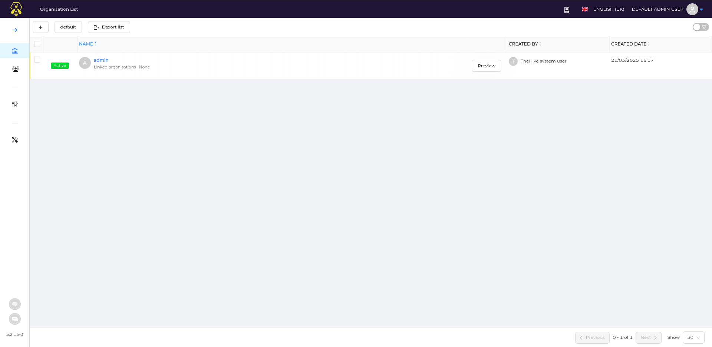

# Configure the wazuh server and thehive

## thehive 

### Setup cassandra
* Changing in `/etc/cassandra/cassandra.yaml`

    ```bash
    cluster_name: 'mydfir'
    rpc_address: <thehive_ip>
    listen_address: <thehive_ip>
    seed_provider:
        - class_name: org.apache.cassandra.locator.SimpleSeedProvider
        parameters:
            - seeds: "<thehive_ip>:7000"
    ```

    `Note`: Replace `<thehive_ip>` with the IP address of thehive server after finding these lines in the file.

* Remove old data from the `/var/lib/cassandra/` directory.

    ```bash
    systemctl stop cassandra
    sudo rm -rf /var/lib/cassandra/*
    systemctl start cassandra
    ```

### Setup elasticsearch

* changing in `/etc/elasticsearch/elasticsearch.yml`

    ```bash
    cluster.name: thehive
    node.name: node-1
    network.host: <thehive_ip>
    http.port: 9200
    cluster.initial_master_nodes: ["node-1"]
    ```

    `Note`: Replace `<thehive_ip>` with the IP address of thehive server after finding these lines in the file.

    ```bash
    systemctl restart elasticsearch
    systemctl enable elasticsearch
    ```

### Setup thehive

* check permission of the `/opt/thp` directory

    ```bash
    chown -R thehive:thehive /opt/thp
    ```

* changing in `/etc/thehive/application.conf`

    ```bash 
    db.janusgraph {
    storage {
        backend = cql
        hostname = ["167.71.228.111"]
        # Cassandra authentication (if configured)
        # username = "thehive"
        # password = "password"
        cql {
        cluster-name = mydfir
        keyspace = thehive
        }
    }
    index.search {
        backend = elasticsearch
        hostname = ["167.71.228.111"]
        index-name = thehive
        }
    }
    ```

    ```bash
    application.baseUrl = "http://<thehive-ip>:9000"
    ```

Just make sure all 3 services are running and you should be good to go.

```bash
systemctl start cassandra
systemctl status cassandra
systemctl start elasticsearch
systemctl status elasticsearch
systemctl start thehive
systemctl status thehive
```

Now, you can access thehive on `http://<thehive-ip>:9000`
credentials are 'admin@thehive.local' with a password of 'secret'

We will face some issues while setting up thehive, so let's fix them.

### Fixing thehive issues

***OPTIONAL ELASTICSEARCH***
Create a jvm.options file under /etc/elasticsearch/jvm.options.d and put the following configurations in that file.

```
-Dlog4j2.formatMsgNoLookups=true
-Xms2g
-Xmx2g
```




## Wazuh

nothing to do here, just install the wazuh manager and agent on the server and the client. and you are good to go.
