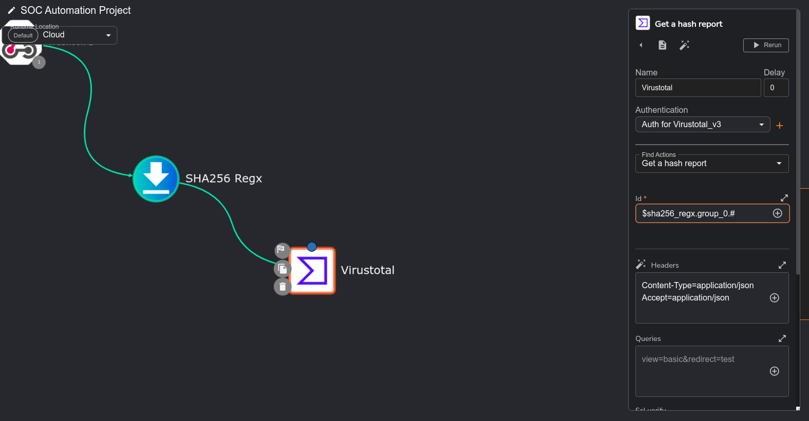
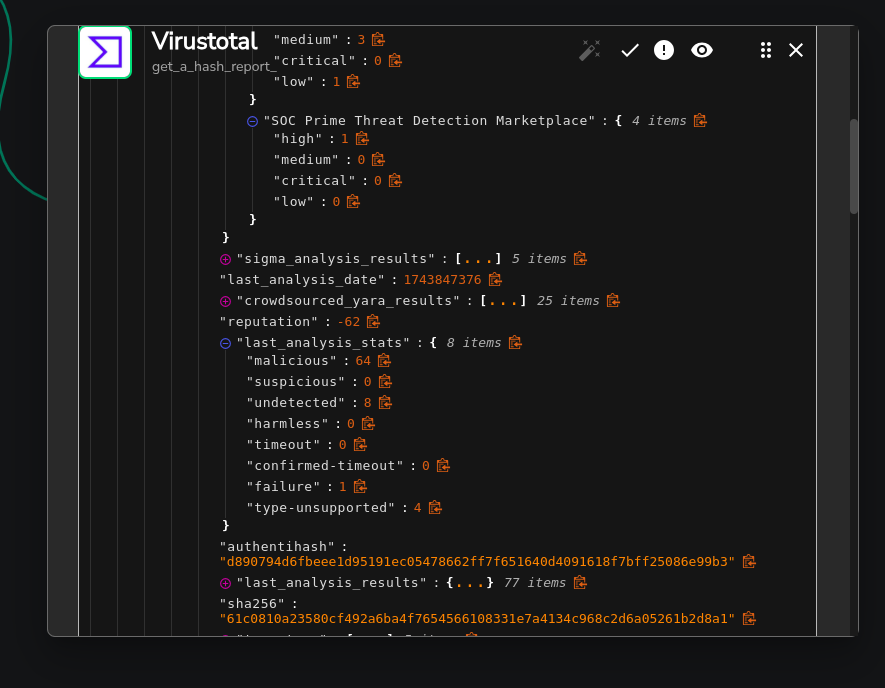

# Configure shuffle to integrate wazuh with theHive

Today we will use shuffle to integrate Wazuh with TheHive. We will use the Wazuh API to get alerts and send them to TheHive using its API.

## Workflow
1. Mimikatz Alert sent to shuffle
2. Shuffle recieve mimikatz alert, 
    * extract SHA256 Hash from file
3. Check reputation Score from virustotal
4. Sent details to thehive To Create Alert
5. Sent email to SOC analyst to Begin Investigation

### Connect shuffle to Wazuh
In this image, we will see how to connect shuffle to Wazuh. We will use the Wazuh API to get alerts and send them to TheHive using its API.
* we added a shuffle webhook to Wazuh, copy the webhook URL and paste it in the shuffle webhook URL.

1. go to wazuh cli and open ossec.conf
    ```bash
    sudo nano /var/ossec/etc/ossec.conf
    ```
2. add the following lines to the ossec.conf file
    ```xml
    <integration>
        <name>shuffle</name>
        <hook_url>https://shuffler.io/api/v1/hooks/webhook_7e0ee92c-b899-4c37-8c94-78b73bd8cc75 </hook_url>
        <rule_id>100002</rule_id>   
        <alert_format>json</alert_format>
    </integration>
    <!-- Note: to add own shuffle hook api -->
    ```
3. restart the Wazuh manager
    ```bash
    sudo systemctl restart wazuh-manager
    ```
4. check the Wazuh logs to see if the integration is working
    * run mimikatz to generate alerts
    * and boom, we have alerts in the shuffle dashboard
    

5. Extract SHA256 Hash from shuffle
    * we will use the shuffle's Regex capture group to extract the SHA256 hash from the alert
    * we will use the following regex to extract the SHA256 hash from the alert
    ```regex
    SHA256=([A-F0-9]{64})
    ```
    

### Check reputation score from virustotal

1. we will use the virustotal API to check the reputation score of the SHA256 hash
2. set these values first get api key from virustotal
3. Click on authantication and submit your api key in shuffle.
4. Make sure to set the values accordingly

5. Re-run the workflow and boom you got results from virustotal
 

### Create alert in theHive
1. First we will create a user `Mydfir` on theHive and assign it to the `analyst` role pass: `f1nd1fY0uc4n`

2. one more user will be created for service account for shuffle, create api key `6QmnYJPVhdOfJjL+l5YsRMFGIcWBKepI`
3. Now login to theHive with the user `Mydfir`.

#### configure theHive API in shuffle